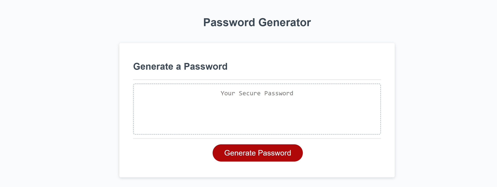

# Random-Password
Random Password Generator

## Description
This is a random password generator. The user may click the button, which initiates a series of question prompts. They are firstly asked how long they would like the password to be. They can choose any number between 8 and 28, which determines how many characters will be in the randomly generated password. They are then asked if they would like to include lowercase letters, uppercase letters, numbers, and special characters. The password is then formulated to fit the users specified criteria, so long as they at least choose yes on one of the promts and choose a character ammount within the specified limit. Otherwise, an error will occur and they will be aked to redo the process. 

The link to the live site is right [Here](https://dawsonbolen.github.io/Random-Password/)

The link to the repo is [Here](https://github.com/DawsonBolen/Random-Password);

## Installation
NA

## Usage
This could be used by any company or service that allows users to create an account with an email or password. Some sites give users the ability to create their own passwords if they want, but also have a random generator if the user wants one created for them. 

## Credits
NA

## License
MIT